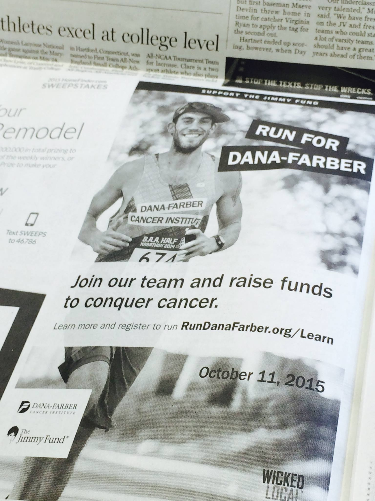

This morning, I'm in much better spirits. I managed to get a full night's sleep, even sleeping in a bit, racking up around 10 to 11 hours in total. There's a hopeful feeling that I might be getting back to my normal routine soon.

I've discovered an upcoming event, the [White Lake Ultras 24 Hour](https://ultrasignup.com/register.aspx?did=109471), happening in May. It's a 3-mile loop set in the scenic New Hampshire landscape. I've grown fond of these kinds of races, and I'm curious to see how well I can prepare for it in the next few months.

Today, I'm experiencing a kind of 'zen' state - my mind feels open and uncluttered, which is quite a nice sensation.

I won't be running today, though. Despite my eagerness to return to training, I'm still recuperating from what seems to have been COVID.

For a bit of nostalgia, here's a Flashback Friday to being in a Dana Farber advertisement. The picture was taken during the 2014 BAA Half Marathon, a race I thoroughly enjoyed and where I achieved my best half marathon time, ~1:26.