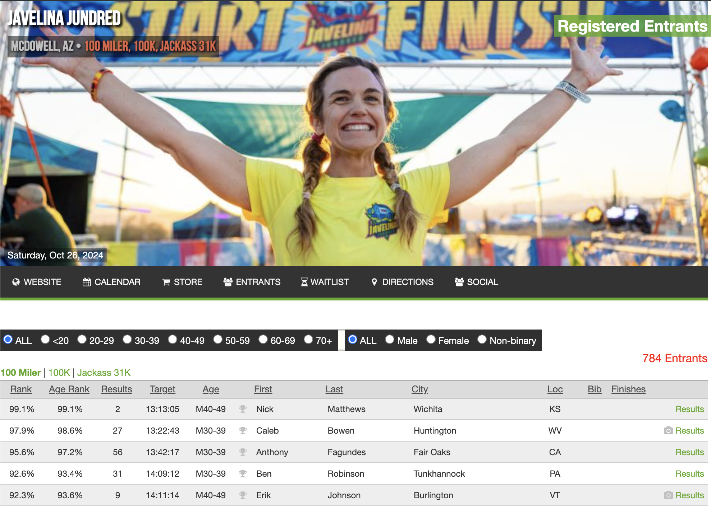

<figure>
  <blockquote>
    Go into every race with a plan in mind.
  </blockquote>
  <figcaption>Arthur Lydiard</figcaption>
</figure>

It turns out I've contracted COVID. I realized it last night when I lost my sense of taste, and then a fever of 101 set in. The most annoying symptom by far is continuous hiccups, which, after some research, I learned could be a COVID-related issue and might persist for several days. This means running is off the table for today. Yesterday wasn't very eventful, though I did manage to read "Running with Lydiard," which is packed with valuable insights.

In more exciting news, I've signed up for my very first 100-mile race – the Javelina Jundred happening in late October. It's too soon to speculate about the finish time I'm aiming for, but my goal is to be in peak condition. Finishing in under 16 hours would be an incredible achievement. The race is a qualifier for the Western States, which is the ultimate dream, but hitting the 13-hour mark necessary to earn a Golden Ticket seems a bit beyond reach right now.