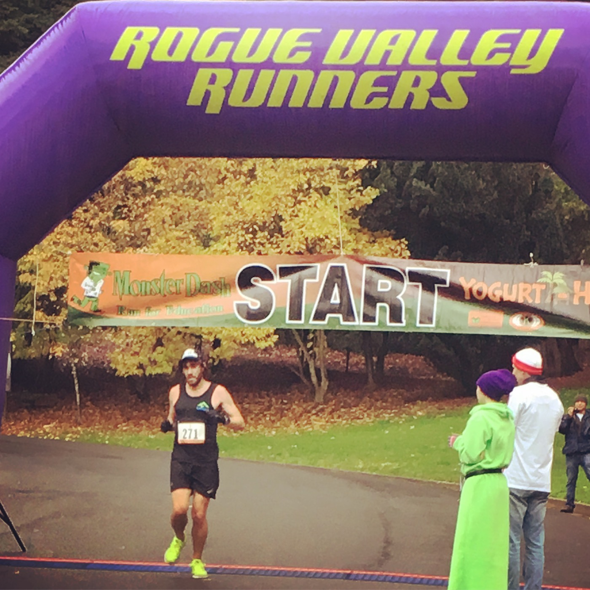

<figure>
  <blockquote>
    Inspiration is for amateurs. The rest of us just show up and get to work. If you wait around for the clouds to part and a bolt of lightning to strike you in the brain, you are not going to make an awful lot of work. All the best ideas come out of the process; they come out of the work itself.
  </blockquote>
  <figcaption>Chuck Close</figcaption>
</figure>

Day 7! One week of writing is now in the books. I began today with drinking 500 ml of water. I am working on staying hydrated both throughout the day and throughout my runs. It's an important habit. One thing I learned years ago from Eric Orton was to hydrate consistently when you run. It's the one thing that if you get behind on in a race, it's very hard to to catch up on.

Yesterday I ran 45 minutes in Zone 2. I probably could have gone longer but I don't want to jump in mileage too much this week. I was also creeping out of the zone by the time the run ended.

<figure>
    
    <figcaption>Photo of the Day: 2016 Monster Dash, 4th Overall.</figcaption>
</figure>

Today I'm running for an hour. I am thinking all of my runs will be in Zone 2 until I reach my target weight (170 lbs). I will still get my heart rate into the upper zones playing basketball. Also, I have the Bromka marathon lifting routine I'll be doing as well at least once a week. That should cover my bases.